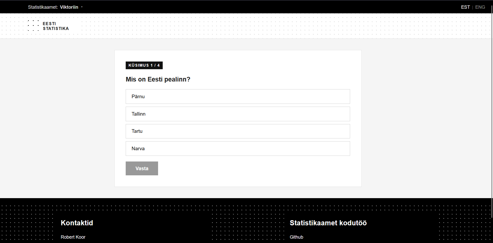
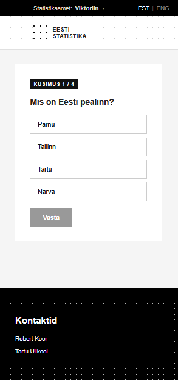

# Statistikaamet Homework - ENGLISH

An interactive quiz about Estonian statistics, created as a homework assignment for Statistics Estonia (Statistikaamet) for 2026 internship.

🔗 **Live demo:** [rbr4t.github.io/Statistikaamet-proovit-](https://rbr4t.github.io/Statistikaamet-proovit-/)

---

## Technologies

- [React](https://react.dev/) + [TypeScript](https://www.typescriptlang.org/)
- [Vite](https://vitejs.dev/)
- [Playwright](https://playwright.dev/) — automated tests
- GitHub Pages — hosting

---

## Features

- Multiple choice questions about Estonian statistics
- Randomized answer order on every playthrough
- Immediate feedback — correct or incorrect answer
- Final score screen with a full review of all answers
- Fully responsive — works on both mobile and desktop

---

## Running Locally

```bash
# Clone the repo
git clone https://github.com/Rbr4t/Statistikaamet-proov.git
cd Statistikaamet-proovit-

# Install dependencies
npm install

# Start the development server
npm run dev
```

Open your browser at `http://localhost:5173`

---

## Running Tests

```bash
npx playwright test
```

---

## Screenshots



---

## Author

**Robert Koor** — University of Tartu

# Statistikaamet Kodutöö - EESTI

Interaktiivne viktoriin Eesti statistika kohta, loodud Statistikaameti kodutöö raames 2026 praktika raames.

🔗 **Live demo:** [rbr4t.github.io/Statistikaamet-proov](https://rbr4t.github.io/Statistikaamet-proov/)

---

## Tehnoloogiad

- [React](https://react.dev/) + [TypeScript](https://www.typescriptlang.org/)
- [Vite](https://vitejs.dev/)
- [Playwright](https://playwright.dev/) — automaattestid
- GitHub Pages — hostimine

---

## Funktsionaalsus

- Mitmevalikulised küsimused Eesti statistika kohta
- Juhuslik vastuste järjekord igal mängimisel
- Kohene tagasiside — õige või vale vastus
- Lõpptulemus koos ülevaatega kõigist vastustest
- Täielikult responsiivne — töötab nii telefonis kui arvutis

---

## Käivitamine lokaalselt

```bash
# Klooni repo
git clone https://github.com/Rbr4t/Statistikaamet-proov.git
cd Statistikaamet-proov

# Paigalda dependencies
npm install

# Käivita arendusserver
npm run dev
```

Ava brauser aadressil `http://localhost:5173`

---

## Testide käivitamine

```bash
npx playwright test
```

---

## Screenshots


---

## Autor

**Robert Koor** — Tartu Ülikool